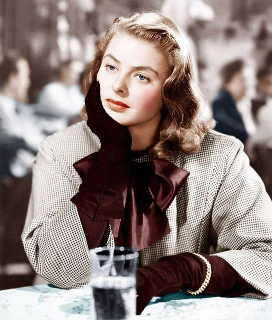

# 🎬 Ingrid Bergman: Brilliant, But Emotionally Distant?  

Ingrid Bergman is often spoken about with a kind of untouchable reverence when it comes to classic Hollywood. And don’t get me wrong — she was brilliant. She had that rare blend of international flair, quiet beauty, and real acting chops. She’s got some absolute classics under her belt: *Casablanca* (1942), *Notorious* (1946), *Gaslight* (1944), and even later works like *Autumn Sonata* (1978). She won three Oscars, worked with Hitchcock, and pretty much defined “timeless elegance.”

But here's my hot take — and maybe the only hot take on a Golden Age actress I actually stand by:

> **Bergman was technically flawless but emotionally remote — especially compared to some of her contemporaries.**

That’s not to say she wasn’t talented. It’s just that her performances often feel like they’re operating at arm’s length. She makes you observe emotion rather than feel it with her. And when you actually start rewatching her films with that lens, the pattern becomes pretty hard to ignore.

<figure>
  
  <figcaption><em>Ingrid Bergman publicity photo for <strong>Notorious</strong> (1946)</em></figcaption>
</figure>

---

## 🕯️ *Gaslight* (1944): Controlled Breakdown

Let’s start with the film that won her her first Oscar — *Gaslight*. In it, Bergman plays Paula Alquist, a woman slowly driven insane by her manipulative husband. This could’ve been a powerhouse role — it’s literally about psychological torment, paranoia, and emotional unraveling.

But instead of descending into raw instability, Bergman’s performance is almost *too* measured. Even at her lowest point, she doesn’t quite let the panic consume her. There’s a visible performance of fear — a furrowed brow, a tremble in her voice — but it still feels like she’s holding back. For a film that’s supposed to feel claustrophobic and maddening, her composure gives the movie a weird air of detachment.

Compare that to someone like **Joan Fontaine in *Rebecca* (1940)** — similar “gaslighted wife” vibes — and you get a more visceral experience. Fontaine feels cornered, fragile, and terrified. Bergman? Still kind of looks like she’s ready for a magazine cover.

---

## 🕊 *Casablanca* (1942): The Most Passive Love Triangle Ever?

This one’s going to hurt some people, but we have to talk about *Casablanca*. Yes, it’s one of the greatest films of all time. Yes, the script is basically perfect. But if you really study Ingrid Bergman’s performance as Ilsa, it’s… underwhelming?

The character is caught in one of the most famous love triangles in cinema history — torn between past love Rick (Bogart) and current husband Laszlo. Yet Bergman’s emotional presence in the film is strangely muted. Her facial expressions are often vague, her delivery soft and distant, and she spends a good chunk of the film looking confused, stunned, or wistful — but not much more.

Look at the scene where Rick and Ilsa reunite at his bar. **Bogart’s face is burning** with regret, resentment, and bitterness. Bergman, meanwhile, kind of just stares. Or when she begs him to think for both of them at the airport — again, she’s saying all the right things, but the emotion is paper-thin. The love story relies heavily on the idea of their past, not the chemistry we’re seeing in the present.

Honestly, Ilsa sometimes feels like a character that things happen *to* rather than someone who acts with emotional agency.

---

## 🥂 *Notorious* (1946): A High-Stakes Romance, But Where’s the Heat?

*Notorious* is probably her most emotionally layered Hollywood role — she plays Alicia Huberman, a party girl turned spy who falls in love with Devlin (Cary Grant) while being sent on a dangerous mission. There’s a lot of emotional territory to explore here: guilt, longing, fear, betrayal.

And yet again, Bergman plays it with this air of elegance that borders on detachment. The scenes where she’s supposed to be heartbroken over Devlin’s coldness don’t quite land — she looks more tired than shattered. Even when she’s slowly being poisoned by her Nazi husband (long story), the horror reads more like “mild concern.”

To her credit, there are moments in this film where you glimpse what Bergman could do if she pushed herself — the wine cellar scene, for instance, is genuinely tense. But even there, her emotions are so internalized that they almost get lost in the scenery.

---

## 🔥 Compared to Her Peers?

Let’s be real: classic Hollywood was filled with actresses who knew how to burn on screen. **Vivien Leigh** (*A Streetcar Named Desire*, *Gone with the Wind*) could unravel with terrifying intensity. **Bette Davis** (*Now, Voyager*, *All About Eve*) could make a single line reading feel like a dagger. Even **Katharine Hepburn**, with all her quirky confidence, brought way more fire to her roles.

Bergman, by contrast, often felt restrained. Her performances were elegant, even when the material demanded chaos. There’s a kind of unshakeable control to her — which, sure, can be impressive — but it makes her harder to emotionally connect with.

---

## And So Let's Circle Back

None of this is to say Ingrid Bergman wasn’t talented. She absolutely was. But I do think we sometimes conflate *technical precision* with *emotional resonance*. And for me, Bergman falls into that uncanny valley where I respect her performances more than I feel them.

She was magnetic. She was refined. She was beautiful.  
But did she ever really **bleed** on screen?

That’s up for debate. And in my case, it’s a soft but confident *no*.

